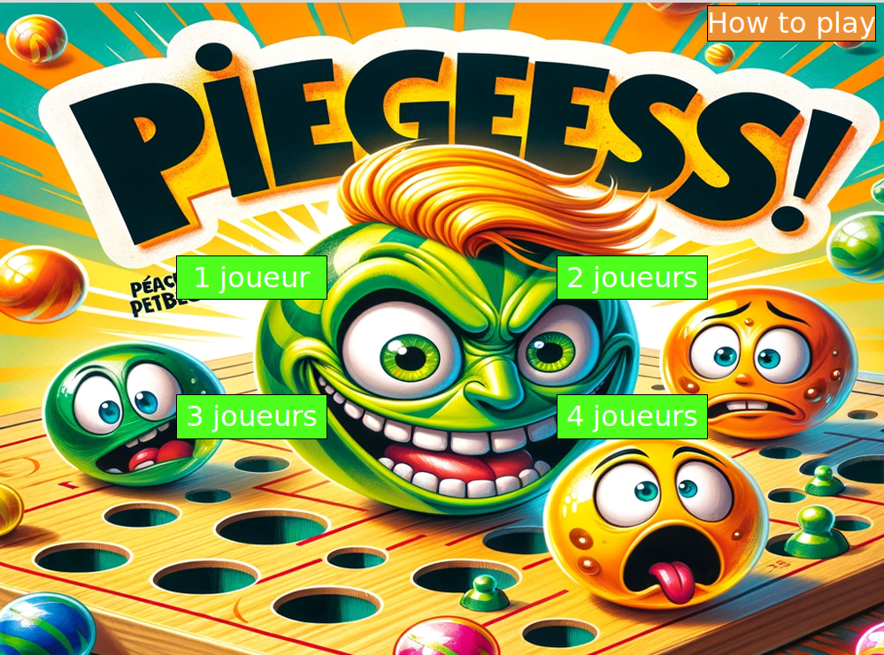

# Piège - Jeu de Stratégie en Python

> **Piège** est un jeu de stratégie multijoueur développé en **Python**, inspiré du célèbre jeu *Stay Alive* (Milton Bradley, 1971).  
> L’objectif : être le dernier à conserver au moins une bille sur le plateau !  
> Ce projet a été réalisé dans le cadre de ma première année d’études (**L1 Informatique**) afin de pratiquer la conception de jeux interactifs et la gestion de projets Python.

---

## Aperçu du jeu

>   
---

## Concept et Règles du jeu

Le jeu se déroule en deux phases :
### 1️ Phase de placement :
- Jusqu’à **4 joueurs** peuvent participer.
- Chaque joueur place ses billes tour à tour sur le plateau (les trous visibles doivent être évités).

### 2️ Phase de jeu :
- À chaque tour, un joueur déplace une **tirette** (horizontale ou verticale).
- Si des trous se superposent, les billes tombent !
- Le **dernier joueur** à posséder au moins une bille sur le plateau remporte la partie.
---

## Fonctionnalités

- De **1 à 4 joueurs** (mode local tour par tour).
- Interface graphique avec **FLTK**.
- Gestion des déplacements des tirettes et des collisions.
- Système de **score** avec affichage du vainqueur à la fin.
- Menu complet avec choix du nombre de joueurs, lecture des règles, rejouer, quitter.
---

## Comment jouer
- **Souris** :
  - Cliquez pour **placer les billes**.
  - Cliquez sur les **tirettes** pour les déplacer.
- Le jeu indique à l’écran l’étape en cours (placement, déplacement, fin de partie).
---

## Installation

1. Clone le dépôt :

```bash
git clone https://github.com/taousoumaouche/piege_python.git
cd piege_python
```

2. Lancez simplement le jeu :

```bash
python pieges.py
```
> Aucun besoin d’installer de librairies externes, le projet utilise `fltk.py` inclus dans le dépôt.
---
## Structure du projet
```
/assets             # Images (menu, grille, fonds, etc.)
/src                # fltk.py (bibliothèque graphique utilisée)
pieges.py           # Le code source principal
V1.py               # Première version de jeu (sans graphique)
README.md           # Ce fichier
```

## Auteur
Projet développé par **Oumaouche Taous**, étudiante en **L1 Informatique**.

---
## Licence
Ce projet est libre d’utilisation et de modification à des fins **pédagogiques** ou **personnelles**.  
N’hésitez pas à contribuer ou à proposer des améliorations !

---